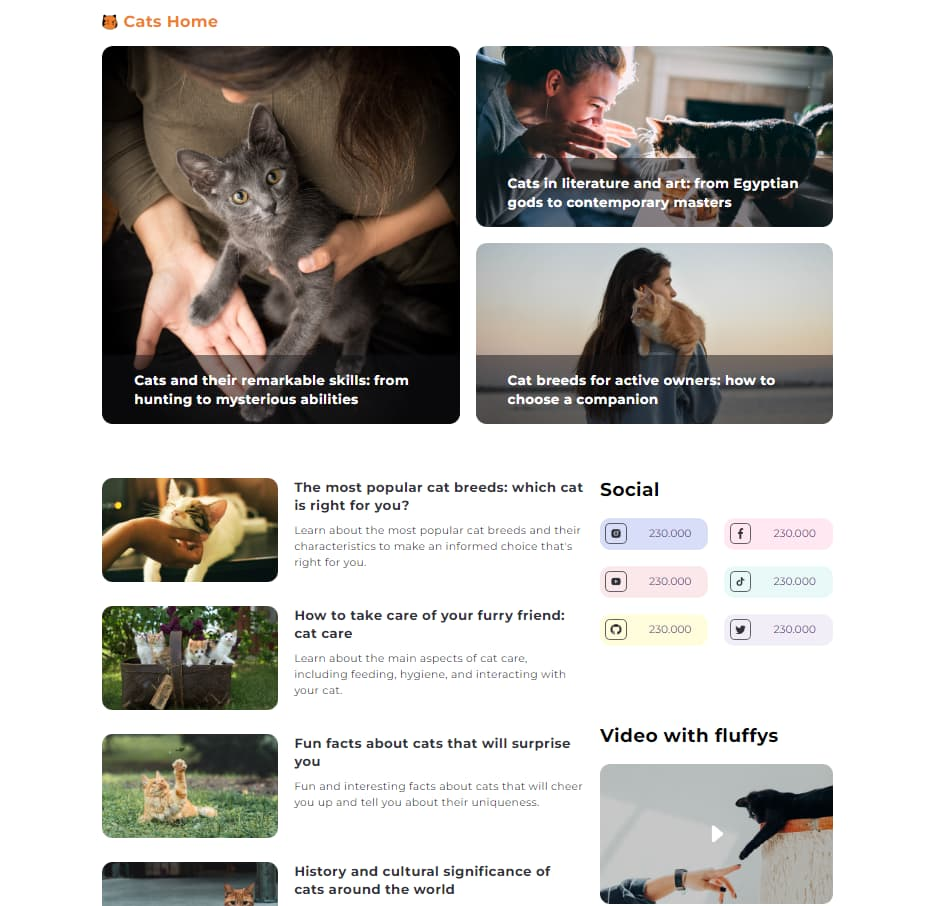

# Cats Home

## Description

Cats Home is a personal project that I developed to practice and deepen my understanding of CSS Grid technology. The project combines my passion for cats with my interest in web development, specifically in exploring the capabilities of CSS Grid to create responsive and aesthetically pleasing web layouts. This project showcases a gallery of cats and provides information about different breeds, all laid out in a clean and responsive design using CSS Grid.

## Features

- A responsive gallery of cat images, utilizing CSS Grid for a fluid and adaptable layout.
- Detailed sections on cat breeds and care, structured with CSS Grid to maintain an engaging user experience across various devices.
- Interactive elements designed to captivate users, demonstrating the practical use of CSS Grid in web design.

## Installation and Setup

To explore the CSS Grid implementation in Cats Home, follow these steps:

1. Clone the repository: `git clone https://github.com/yurii-corssa/cats-home.git`
2. Open `index.html` in your browser to view the project and its CSS Grid-based layout.

## Usage

As you navigate through the website, take note of the layout intricacies and responsiveness provided by CSS Grid. This project serves as both a showcase of cats and a testament to the versatility and power of CSS Grid in creating complex web layouts.
